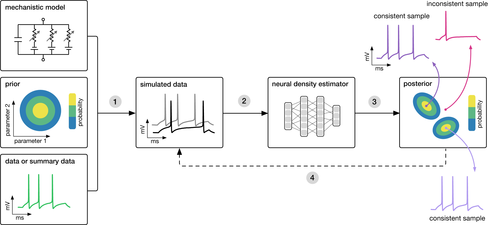

# `sbi`: simulation-based inference

`sbi`: A Python toolbox for simulation-based inference.


Inference can be run in a single
line of code:

```python
posterior = infer(prior, simulator, num_simulations=1000, method='SNPE')
```

- To learn about the general motivation behind simulation-based inference, and the
  inference methods included in `sbi`, read on below.

- For example applications to canonical problems in neuroscience, browse the recent
  preprint [Training deep neural density estimators to identify mechanistic models of
  neural dynamics](https://www.biorxiv.org/content/10.1101/838383v3).

- If you want to get started using `sbi` on your own problem, jump to
  [installation](install.md) and then check out the [tutorial](tutorial/00_getting_started.md).

## Motivation and approach

Many areas of science and engineering make extensive use of complex, stochastic,
numerical simulations to describe the structure and dynamics of the processes being
investigated.

A key challenge in simulation-based science is constraining these simulation models'
parameters, which are intepretable quantities, with observational data. Bayesian
inference provides a general and powerful framework to invert the simulators, i.e.
describe the parameters which are consistent both with empirical data and prior
knowledge.

In the case of simulators, a key quantity required for statistical inference, the
likelihood of observed data given parameters, $\mathcal{L}(\theta) = p(x_o|\theta)$, is
typically intractable, rendering conventional statistical approaches inapplicable.

`sbi` implements three powerful machine-learning methods that address this problem:

- Sequential Neural Posterior Estimation (SNPE),
- Sequential Neural Likelihood Estimation (SNLE), and
- Sequential Neural Ratio Estimation (SNRE).

Depending on the characteristics of the problem, e.g. the dimensionalities of the
parameter space and the observation space, one of the methods will be more suitable.



**Goal: Algorithmically identify mechanistic models which are consistent with data.**

Each of the methods above needs three inputs: A candidate mechanistic model, prior
knowledge or constraints on model parameters, and observational data (or summary statistics
thereof).

The methods then proceed by

1. sampling parameters from the prior followed by simulating synthetic data from
   these parameters,
2. learning the (probabilistic) association between data (or
   data features) and underlying parameters, i.e. to learn statistical inference from
   simulated data. They way in which this association is learned differs between the
   above methods, but all use deep neural networks.
3. This learned neural network is then applied to empirical data to derive the full
   space of parameters consistent with the data and the prior, i.e. the posterior
   distribution. High posterior probability is assigned to parameters which are
   consistent with both the data and the prior, low probability to inconsistent
   parameters. While SNPE directly learns the posterior distribution, SNLE and SNRE need
   an extra MCMC sampling step to construct a posterior.
4. If needed, an initial estimate of the posterior can be used to adaptively generate
   additional informative simulations.


## Publications

See [Cranmer, Brehmer, Louppe (2020)](https://www.pnas.org/content/early/2020/05/28/1912789117) for a recent
review on simulation-based inference.

The following papers offer additional details on the inference methods included in
`sbi`:


### SNPE

- **Fast ε-free Inference of Simulation Models with Bayesian Conditional Density Estimation**<br> by Papamakarios & Murray (NeurIPS 2016) <br>[[PDF]](https://papers.nips.cc/paper/6084-fast-free-inference-of-simulation-models-with-bayesian-conditional-density-estimation.pdf) [[BibTeX]](https://papers.nips.cc/paper/6084-fast-free-inference-of-simulation-models-with-bayesian-conditional-density-estimation/bibtex)

- **Flexible statistical inference for mechanistic models of neural dynamics** <br> by Lueckmann, Goncalves, Bassetto, Öcal, Nonnenmacher & Macke (NeurIPS 2017) <br>[[PDF]](https://papers.nips.cc/paper/6728-flexible-statistical-inference-for-mechanistic-models-of-neural-dynamics.pdf) [[BibTeX]](https://papers.nips.cc/paper/6728-flexible-statistical-inference-for-mechanistic-models-of-neural-dynamics/bibtex)

- **Automatic posterior transformation for likelihood-free inference**<br>by Greenberg, Nonnenmacher & Macke (ICML 2019) <br>[[PDF]](http://proceedings.mlr.press/v97/greenberg19a/greenberg19a.pdf) [[BibTeX]](data:text/plain;charset=utf-8,%0A%0A%0A%0A%0A%0A%40InProceedings%7Bpmlr-v97-greenberg19a%2C%0A%20%20title%20%3D%20%09%20%7BAutomatic%20Posterior%20Transformation%20for%20Likelihood-Free%20Inference%7D%2C%0A%20%20author%20%3D%20%09%20%7BGreenberg%2C%20David%20and%20Nonnenmacher%2C%20Marcel%20and%20Macke%2C%20Jakob%7D%2C%0A%20%20booktitle%20%3D%20%09%20%7BProceedings%20of%20the%2036th%20International%20Conference%20on%20Machine%20Learning%7D%2C%0A%20%20pages%20%3D%20%09%20%7B2404--2414%7D%2C%0A%20%20year%20%3D%20%09%20%7B2019%7D%2C%0A%20%20editor%20%3D%20%09%20%7BChaudhuri%2C%20Kamalika%20and%20Salakhutdinov%2C%20Ruslan%7D%2C%0A%20%20volume%20%3D%20%09%20%7B97%7D%2C%0A%20%20series%20%3D%20%09%20%7BProceedings%20of%20Machine%20Learning%20Research%7D%2C%0A%20%20address%20%3D%20%09%20%7BLong%20Beach%2C%20California%2C%20USA%7D%2C%0A%20%20month%20%3D%20%09%20%7B09--15%20Jun%7D%2C%0A%20%20publisher%20%3D%20%09%20%7BPMLR%7D%2C%0A%20%20pdf%20%3D%20%09%20%7Bhttp%3A%2F%2Fproceedings.mlr.press%2Fv97%2Fgreenberg19a%2Fgreenberg19a.pdf%7D%2C%0A%20%20url%20%3D%20%09%20%7Bhttp%3A%2F%2Fproceedings.mlr.press%2Fv97%2Fgreenberg19a.html%7D%2C%0A%20%20abstract%20%3D%20%09%20%7BHow%20can%20one%20perform%20Bayesian%20inference%20on%20stochastic%20simulators%20with%20intractable%20likelihoods%3F%20A%20recent%20approach%20is%20to%20learn%20the%20posterior%20from%20adaptively%20proposed%20simulations%20using%20neural%20network-based%20conditional%20density%20estimators.%20However%2C%20existing%20methods%20are%20limited%20to%20a%20narrow%20range%20of%20proposal%20distributions%20or%20require%20importance%20weighting%20that%20can%20limit%20performance%20in%20practice.%20Here%20we%20present%20automatic%20posterior%20transformation%20(APT)%2C%20a%20new%20sequential%20neural%20posterior%20estimation%20method%20for%20simulation-based%20inference.%20APT%20can%20modify%20the%20posterior%20estimate%20using%20arbitrary%2C%20dynamically%20updated%20proposals%2C%20and%20is%20compatible%20with%20powerful%20flow-based%20density%20estimators.%20It%20is%20more%20flexible%2C%20scalable%20and%20efficient%20than%20previous%20simulation-based%20inference%20techniques.%20APT%20can%20operate%20directly%20on%20high-dimensional%20time%20series%20and%20image%20data%2C%20opening%20up%20new%20applications%20for%20likelihood-free%20inference.%7D%0A%7D%0A)

### SNLE

- **Sequential neural likelihood: Fast likelihood-free inference with autoregressive flows**<br>by Papamakarios, Sterratt & Murray (AISTATS 2019) <br>[[PDF]](http://proceedings.mlr.press/v89/papamakarios19a/papamakarios19a.pdf) [[BibTeX]](https://gpapamak.github.io/bibtex/snl.bib)

### SNRE

- **Likelihood-free MCMC with Amortized Approximate Likelihood Ratios**<br>by Hermans, Begy & Louppe (ICML 2020) <br>[[PDF]](https://pdfs.semanticscholar.org/9702/b20a18475637005288c5f0216e31a0d7bcc7.pdf)

- **On Contrastive Learning for Likelihood-free Inference**<br>Durkan, Murray & Papamakarios (ICML 2020) <br>[[PDF]](https://arxiv.org/abs/2002.03712).
