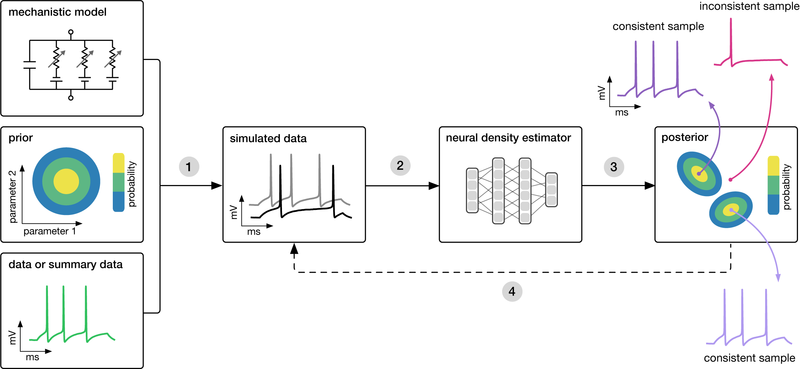

.. sbi documentation master file, created by
   sphinx-quickstart on Tue Oct 18 10:21:12 2022.
   You can adapt this file completely to your liking, but it should at least
   contain the root `toctree` directive.

Welcome to ``sbi``!
===================

``sbi`` is a Python package for simulation-based inference, designed to meet the needs of
both researchers and practitioners. Whether you need fine-grained control or an
easy-to-use interface, ``sbi`` has you covered.

With ``sbi``, you can perform parameter inference using Bayesian inference: Given a
simulator that models a real-world process, SBI estimates the full posterior
distribution over the simulator's parameters based on observed data. This distribution
indicates the most likely parameter values while additionally quantifying uncertainty
and revealing potential interactions between parameters.

``sbi`` provides access to simulation-based inference methods via a user-friendly
interface:

.. code-block:: python

   import torch
   from sbi.inference import NPE

   # define shifted Gaussian simulator.
   def simulator(θ): return θ + torch.randn_like(θ)
   # draw parameters from Gaussian prior.
   θ = torch.randn(1000, 2)
   # simulate data
   x = simulator(θ)

   # choose sbi method and train
   inference = NPE()
   inference.append_simulations(θ, x).train()

   # do inference given observed data
   x_o = torch.ones(2)
   posterior = inference.build_posterior()
   samples = posterior.sample((1000,), x=x_o)

Overview
--------

To get started, install the ``sbi`` package with:

.. code-block:: bash

   python -m pip install sbi

for more advanced install options, see our `Install Guide <https://sbi.readthedocs.io/en/latest/installation.html>`_.

Then, check out our material:

.. grid:: 3

   .. grid-item-card:: 🧠 Tutorials
      :link: tutorials
      :link-type: doc

      Step-by-step introductions.

   .. grid-item-card:: 🛠 How-To Guides
      :link: how_to_guide
      :link-type: doc

      Practical recipes for common tasks.

   .. grid-item-card:: 📚 API Reference
      :link: sbi
      :link-type: doc

      Full documentation of modules and functions.

Motivation and approach
-----------------------

Many areas of science and engineering make extensive use of complex, stochastic,
numerical simulations to describe the structure and dynamics of the processes being
investigated.

A key challenge in simulation-based science is constraining these simulation models'
parameters, which are interpretable quantities, with observational data. Bayesian
inference provides a general and powerful framework to invert the simulators, i.e.
describe the parameters that are consistent both with empirical data and prior
knowledge.

In the case of simulators, a key quantity required for statistical inference, the
likelihood of observed data given parameters, :math:`\mathcal{L}(\theta) = p(x_o|\theta)`, is
typically intractable, rendering conventional statistical approaches inapplicable.

``sbi`` implements powerful machine-learning methods that address this problem. Roughly,
these algorithms can be categorized as:

- Neural Posterior Estimation (amortized `NPE` and sequential `SNPE`),
- Neural Likelihood Estimation (`(S)NLE`), and
- Neural Ratio Estimation (`(S)NRE`).

Depending on the characteristics of the problem, e.g. the dimensionalities of the
parameter space and the observation space, one of the methods will be more suitable.

generate additional informative simulations. The diagram also illustrates consistent and inconsistent samples.

**Goal: Algorithmically identify mechanistic models that are consistent with data.**

Each of the methods above needs three inputs: A candidate mechanistic model,
prior knowledge or constraints on model parameters, and observational data (or
summary statistics thereof).

The methods then proceed by

1. sampling parameters from the prior followed by simulating synthetic data from
   these parameters,
2. learning the (probabilistic) association between data (or data features) and
   underlying parameters, i.e. to learn statistical inference from simulated
   data. How this association is learned differs between the above methods, but
   all use deep neural networks.
3. This learned neural network is then applied to empirical data to derive the
   full space of parameters consistent with the data and the prior, i.e. the
   posterior distribution. The posterior assigns high probability to parameters
   that are consistent with both the data and the prior, and low probability to
   inconsistent parameters. While NPE directly learns the posterior
   distribution, NLE and NRE need an extra MCMC sampling step to construct a
   posterior.
4. If needed, an initial estimate of the posterior can be used to adaptively
   generate additional informative simulations.

`Cranmer, Brehmer, Louppe (2020) <https://doi.org/10.1073/pnas.1912789117>`_

Implemented algorithms
----------------------

``sbi`` implements a variety of *amortized* and *sequential* SBI methods.

Amortized methods return a posterior that can be applied to many different
observations without retraining (e.g., NPE), whereas sequential methods focus
the inference on one particular observation to be more simulation-efficient
(e.g., SNPE).

Below, we list all implemented methods and their corresponding publications.
For usage in ``sbi``, see the `Inference API reference <https://sbi.readthedocs.io/en/latest/sbi.html>`_
and the `tutorial on implemented methods <https://sbi.readthedocs.io/en/latest/tutorials/16_implemented_methods.html>`_.

Posterior estimation (``(S)NPE``)
^^^^^^^^^^^^^^^^^^^^^^^^^^^^^^^^^

- **Fast ε-free Inference of Simulation Models with Bayesian Conditional Density Estimation**
  by Papamakarios & Murray (NeurIPS 2016)
  `PDF <https://papers.nips.cc/paper/6084-fast-free-inference-of-simulation-models-with-bayesian-conditional-density-estimation.pdf>`__

- **Flexible statistical inference for mechanistic models of neural dynamics**
  by Lueckmann, Goncalves, Bassetto, Öcal, Nonnenmacher & Macke (NeurIPS 2017)
  `PDF <https://papers.nips.cc/paper/6728-flexible-statistical-inference-for-mechanistic-models-of-neural-dynamics.pdf>`__

- **Automatic posterior transformation for likelihood-free inference**
  by Greenberg, Nonnenmacher & Macke (ICML 2019)
  `PDF <http://proceedings.mlr.press/v97/greenberg19a/greenberg19a.pdf>`__

- **BayesFlow: Learning complex stochastic models with invertible neural networks**
  by Radev, S. T., Mertens, U. K., Voss, A., Ardizzone, L., & Köthe, U. (IEEE transactions on neural networks and learning systems 2020)
  `Paper <https://ieeexplore.ieee.org/abstract/document/9298920>`__

- **Truncated proposals for scalable and hassle-free simulation-based inference**
  by Deistler, Goncalves & Macke (NeurIPS 2022)
  `Paper <https://arxiv.org/abs/2210.04815>`__

- **Flow matching for scalable simulation-based inference**
  by Dax, M., Wildberger, J., Buchholz, S., Green, S. R., Macke, J. H., & Schölkopf, B. (NeurIPS, 2023)
  `Paper <https://arxiv.org/abs/2305.17161>`__

- **Compositional Score Modeling for Simulation-Based Inference**
  by Geffner, T., Papamakarios, G., & Mnih, A. (ICML 2023)
  `Paper <https://proceedings.mlr.press/v202/geffner23a.html>`__

Likelihood-estimation (``(S)NLE``)
^^^^^^^^^^^^^^^^^^^^^^^^^^^^^^^^^^

- **Sequential neural likelihood: Fast likelihood-free inference with autoregressive flows**
  by Papamakarios, Sterratt & Murray (AISTATS 2019)
  `PDF <http://proceedings.mlr.press/v89/papamakarios19a/papamakarios19a.pdf>`__

- **Variational methods for simulation-based inference**
  by Glöckler, Deistler, Macke (ICLR 2022)
  `Paper <https://arxiv.org/abs/2203.04176>`__

- **Flexible and efficient simulation-based inference for models of decision-making**
  by Boelts, Lueckmann, Gao, Macke (Elife 2022)
  `Paper <https://elifesciences.org/articles/77220>`__

Likelihood-ratio-estimation (``(S)NRE``)
^^^^^^^^^^^^^^^^^^^^^^^^^^^^^^^^^^^^^^^^

- **Likelihood-free MCMC with Amortized Approximate Likelihood Ratios**
  by Hermans, Begy & Louppe (ICML 2020)
  `PDF <http://proceedings.mlr.press/v119/hermans20a/hermans20a.pdf>`__

- **On Contrastive Learning for Likelihood-free Inference**
  by Durkan, Murray & Papamakarios (ICML 2020)
  `PDF <http://proceedings.mlr.press/v119/durkan20a/durkan20a.pdf>`__

- **Towards Reliable Simulation-Based Inference with Balanced Neural Ratio Estimation**
  by Delaunoy, Hermans, Rozet, Wehenkel & Louppe (NeurIPS 2022)
  `PDF <https://arxiv.org/pdf/2208.13624.pdf>`__

- **Contrastive Neural Ratio Estimation**
  by Benjamin Kurt Miller, Christoph Weniger & Patrick Forré (NeurIPS 2022)
  `PDF <https://arxiv.org/pdf/2210.06170.pdf>`__

Diagnostics
^^^^^^^^^^^

- **Simulation-based calibration**
  by Talts, Betancourt, Simpson, Vehtari, Gelman (arXiv 2018)
  `Paper <https://arxiv.org/abs/1804.06788>`__

- **Expected coverage (sample-based)**
  as computed in Deistler, Goncalves, & Macke (NeurIPS 2022)
  `Paper <https://arxiv.org/abs/2210.04815>`__ and in Rozet & Louppe
  `Paper <https://matheo.uliege.be/handle/2268.2/12993>`__

- **Local C2ST**
  by Linhart, Gramfort & Rodrigues (NeurIPS 2023)
  `Paper <https://arxiv.org/abs/2306.03580>`__

- **TARP**
  by Lemos, Coogan, Hezaveh & Perreault-Levasseur (ICML 2023)
  `Paper <https://arxiv.org/abs/2302.03026>`__

.. toctree::
   :hidden:
   :maxdepth: 1
   :caption: Getting started

   installation
   tutorials
   examples
   how_to_guide
   advanced_tutorials

.. toctree::
   :hidden:
   :maxdepth: 2
   :caption: More guides/resources

   sbi
   faq
   contributor_guide
   changelog
   credits
